# Retail Sales Forecasting: Beating the Holiday Rush with SARIMAX

I built this project to tackle a classic, retail problem: how to accurately **forecast sales**. Simple models just don't work when you have to account for holiday sales surges, marketing promos, and long-term growth all at once.

My goal was to create a tool that could actually be used by an operations or marketing team. The final model, a fine-tuned **SARIMAX**, doesn't just guess—it **quantifies the impact of promotions** and gives a clear picture of the months ahead, helping teams optimize inventory and stop losing money.

---

## The Business Problem: Why This Matters

Every retailer knows the pain of getting the forecast wrong. It's a constant balancing act that leads to two costly mistakes:

* **Overstocking:** You buy too much, and your cash gets tied up in products that will eventually be sold at a steep discount.
* **Stockouts:** You buy too little, miss out on sales during your busiest season, and send customers to your competitors.

This project was all about building a **reliable solution** to avoid those problems.

---

##  What This Project Can Do

* **Analyzes the Full Picture:** It breaks down the sales data to see the real trend, the 12-month seasonal patterns, and the impact of business decisions.
* **Quantifies What Matters:** It measures the exact sales lift from things like **marketing promotions**.
* **Compares Models Head-to-Head:** I didn't just pick one model. I tested **ARIMA, SARIMAX, and Prophet** to find the undisputed winner.
* **Delivers Actionable Forecasts:** The final model gives a **6-month forecast with a 95% confidence range**, so you're not just getting a single number—you're getting a clear guide for managing risk.
* **Includes the Data:** I've included the Python script I used to generate the realistic 4-year (48-month) **synthetic dataset**, complete with trends, seasonality, and promo flags.

---

## My Workflow: From Data to Forecast

I followed a structured process to make sure the model was built on a solid foundation.

### 1. Data Generation & Prep

First, I needed good data. I built a 4-year synthetic dataset from scratch using `pandas` and `numpy`. This let me create a realistic baseline (`retail_sales_mock_data.csv`) that included:

* A steady **upward trend** through "base_sales = 10000 + np.arange(num_months) * 50" (depicts the company growth).
* Strong **12-month seasonality** (the holiday rush).
* Binary flags for **Promotions** and **Holidays**.
* A bit of random **noise** through np.random.normal (like tiny unpredictable changes in sales such as weather, supply hiccups, customer behavior).

After generating it, I loaded, cleaned, and set up the `Date` index for time series analysis.

 
 
 

### 2. Exploratory Data Analysis (EDA)

Before trying to model anything, I had to understand the data.
**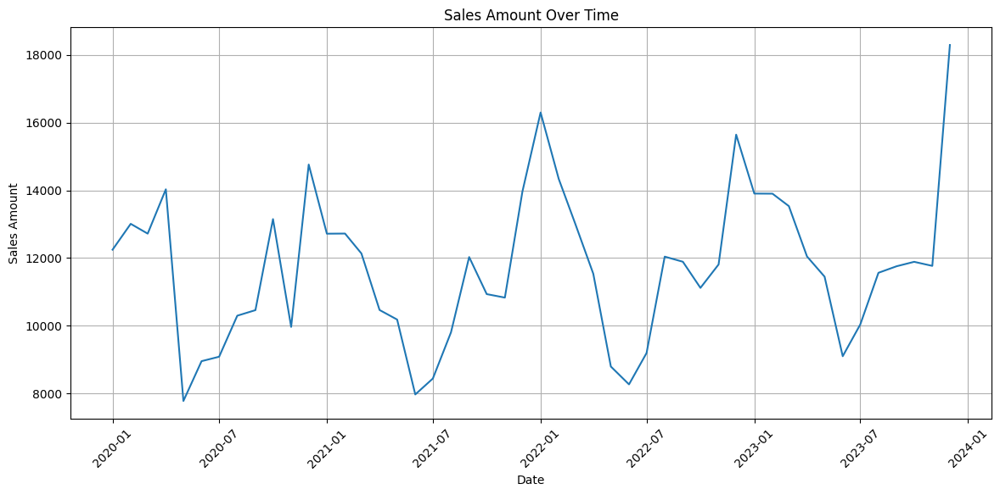**
* **Decomposition :** To properly understand the sales data, I needed to break it down into its main components:
* 1. **Trend**: A long-term increase or decrease in the data over time,
  2. **Seasonality**: A pattern that repeats at regular intervals (e.g., weekly, monthly, yearly)
  3. **Residuals**: The leftover noise

 **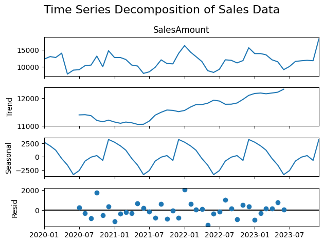**

 **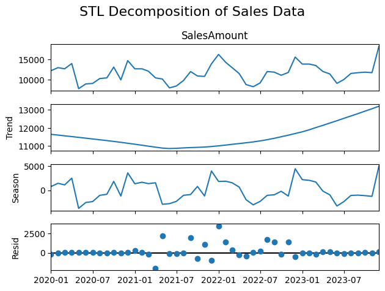**.

* I generated two decomposition plots (shown above) —one classical and STL method. Both plots showed a consistent upward trend, which suggests that my sales are experiencing steady, long-term growth. Critically, the seasonal component in both decompositions revealed significant, repeating yearly patterns, peaking strongly towards the end of the year which is entirely typical for retail holiday rushes. The residuals from the STL decomposition looked even cleaner, appearing randomly distributed around zero. **This robustness of the STL method is important because it confirms the model effectively captured the trend and seasonality, leaving less unexplained noise**

 ****.
 
* **Stationarity (ADF Test):** I ran the Augmented Dickey-Fuller (ADF) test (shown above) to see if the data was stable (stationary) or if it needed transformations. I ran the adfuller test on the SalesAmount column, and the results were great! The ADF Statistic came out very negative at -4.334. More importantly, the p-value was extremely low at 0.000388, which is far below the standard 0.05 significance threshold. Because the p-value is so small, I can confidently reject the null hypothesis that the data is non-stationary (has a unit root). This strong evidence tells me that the sales data is already stationary. This is a huge win because it means I won't have to apply complicated transformations like differencing to stabilize the series before I start building the ARIMA or SARIMA model. The data is ready for modeling

  
* **Analyzing Time Dependency with ACF and PACF**: To prepare for building an effective forecasting model, I needed to understand the time-based dependencies in the sales data. Instead of looking at simple correlation between two different variables, I focused on autocorrelation, which measures how sales at the current month are related to sales from previous months.
* I generated two key plots for this checking up to 24 months (lags) back:
* a. the Autocorrelation Function (ACF)
* b. Partial Autocorrelation Function (PACF),

* **_of_Sales_Amount.png)**.
* **_of_Sales_Amount.png)**
* The Autocorrelation Function (ACF) plot shows how the sales amount at different time lags correlates with the current sales value. At lag 0, the autocorrelation is 1, indicating perfect correlation with itself, as expected. The visible peaks around lag 6 and 12 suggest that there’s a repeating pattern roughly every 6 and 12 months, which points to seasonality — for example, a holiday or shopping trend that happens once a year
* Partial Autocorrelation Function (PACF) plot isolates the direct effect of past months on the current month’s sales, removing the “middle steps.” The biggest drop after lag 1 shows that last month’s sales have the most direct influence, while later months have a weaker or indirect impact.

* In short:
  ACF = “Everything that might have an effect, directly or through other months.”
  PACF = “Only the immediate, direct impact from specific past months.”

 
 
 

### 3. Feature Engineering: Introducing Lagged Sales

* Sales today are often influenced by sales from the last few months. For example, if sales were high last month due to a promotion, that momentum might carry forward.  
* My model needs those past values to “see” that pattern.  
* I wrote a Python function called create_lag_features specifically to handle this.  
* Inside, I used a loop to iterate through a list of specified lag periods (1,2,3,6,12), employing the pandas.shift() method to slide the SalesAmount values down by the appropriate number of months.   
  The column "SalesAmount_lag_1" represents sales from 1 month ago   
  The column "SalesAmount_lag_2" represents sales from 2 months ago  
  The column "SalesAmount_lag_3" represents sales from 3 months ago  
  The column "SalesAmount_lag_6" represents sales from 6 months ago  
  The column "SalesAmount_lag_12" represents sales from 12 month ago   
  
  The lags collectively let my model “look back” over different time horizons — short, medium, and long-term — to learn repeating sales patterns more accurately  

  After running the function, my new DataFrame, "sales_data_with_lags", now has **8 columns**, including the **5 brand-new lag features**.   
  As expected, looking at the .info() output, the total number of entries dropped from 48 to 36 because the first 12 rows were removed due to the 12-month lag.  
  This new, richer dataset, starting from January 2021, was saved to **retail_sales_with_lags.csv**.   
  Finally, I ran the **Augmented Dickey-Fuller (ADF) test one more time** on the new dataset's SalesAmount column.   

**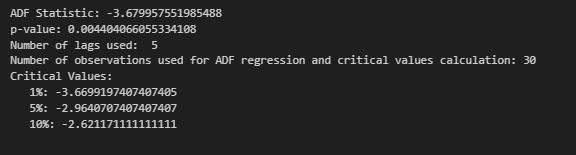**.

  The resulting p-value of 0.0044 is still well below 0.05, confirming that the series remains stationary even after adding the lag features. This successful feature engineering   step means the dataset is now fully prepared for advanced predictive modeling.
     

### 4. The Model: Finding a Winner

I split the data into a **30-month training set** and a **6-month validation set** to see which model could perform best on unseen data.

* **Attempt 1: ARIMA**  

   \> **ARIMA(1,0,1)**

   * I started with a simple ARIMA(1, 0, 1) model, which incorporates one previous month's sales (AR=1) and one previous month's prediction error (MA=1). The I=0 part was             crucial, as I already proved the data was stationary and didn't need differencing.  
   * The arima_model.fit() function executed the machine learning, finding the optimal parameters to minimize the prediction error on the training data. The model summary looked      solid, confirming the parameters were statistically significant. I then immediately used the trained model to forecast sales for the next 6 steps, corresponding directly to      the unseen data in the validationSet. 
   * Comparing the actual sales to the forecast showed a serious problem, especially in December 2023: the actual sales spiked to 18,289, but the model only predicted 11,590,         completely missing the huge seasonal holiday lift.  
     ****  
   * The model struggles significantly with the last data point (December 2023), **under-forecasting the actual sales by nearly $6,700**. This massive error suggests a strong         seasonal spike in December that the simple ARIMA(1,0,1) model failed to capture. The model's forecasts for July through November are much closer to the actual values.
   * This discrepancy has immediate real-world implications; if a business relies on this forecast, they would drastically under-order inventory, leading to missed sales              opportunities and poor customer satisfaction during the peak holiday season.  
   * Finally, I quantified this performance using several metrics  
   ****  
      Mean Absolute Error (MAE): 1636.91 means on average, the model`s forecasts are off by approximately $1,637 per month. 
      Root Mean Squared Error (RMSE): 2803.29   
      This metric is larger than the MAE (2803.29 > 1636.91) because the squaring of the large December error heavily penalizes the RMSE. It indicates that large errors are a          significant problem for this model   
      Mean Absolute Percentage Error (MAPE): 0.11%  
      The average forecast is off by about 11% of the actual sales value. An 11% average error is generally considered acceptable for many real-world sales forecasts, except for       the clear failure in December.
      
     ARIMA_101_Graph
     **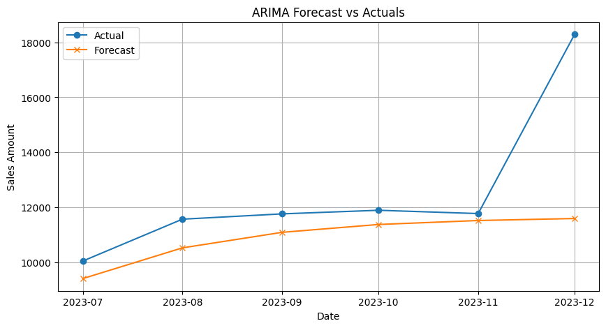**
       

     The forecasts, the errors and the above graph clearly demonstrate that the basic ARIMA model is insufficient 

    * **Attempting and Failing with Multiple ARIMA Variants**

      \> **ARIMA(1,0,0)**    
      **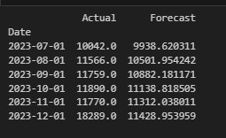**
      **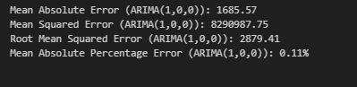**
      **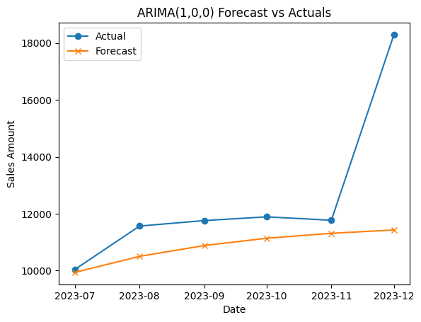**
      
       
      
      \> **ARIMA(0,0,1)**    
      **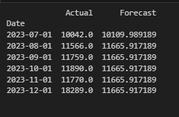**
      **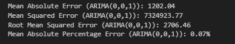**
      **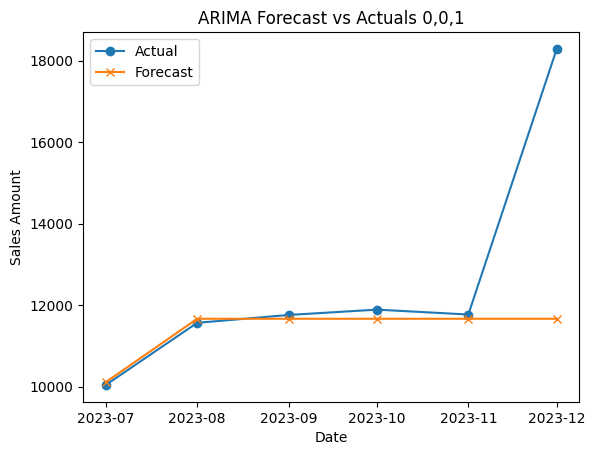**
 

  
      \> **ARIMA(0,0,0)**    
      **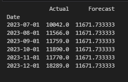**
      **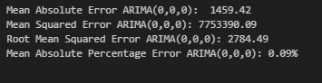**
      **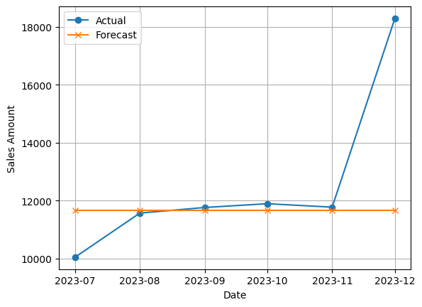**
      
      \> **ARIMA(1,1,1)**    
      ****
      ****
      **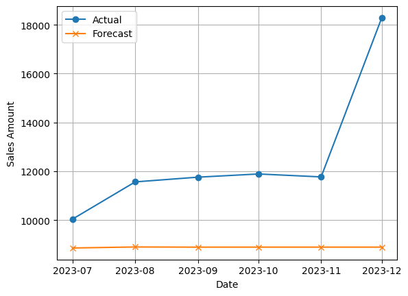**

    * *Result:* A total failure. I tried multiple ARIMA setups, and they all fell flat. They were completely **blind to the 12-month seasonality** and couldn't predict the December sales spike to save their lives. This proved non-seasonal models were useless for this problem.

* **Attempt 2: SARIMA**
    * ARIMA models were failing to capture the retail seasonality, I pivoted to the Seasonal ARIMA (SARIMA) model.

     * **Attempting with Multiple SARIMA Variants**
**
      \> **SARIMA (1,1,1)(1,1,1,12)**    
      ****
      **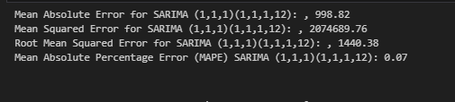**
      **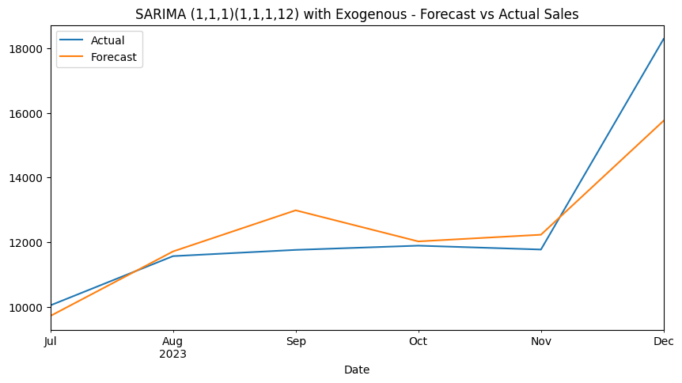****
      
       
**      
      \> **SARIMA (1,1,1)(1,1,1,12) with Exogenous Features**    
      ****
      **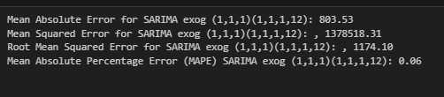**
      ****
 **
  
  
**      \> **SARIMA (1,1,2)(1,0,1,12) with Exogenous Features**    
      **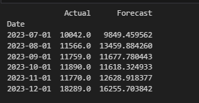**
      **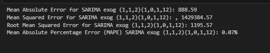**
      **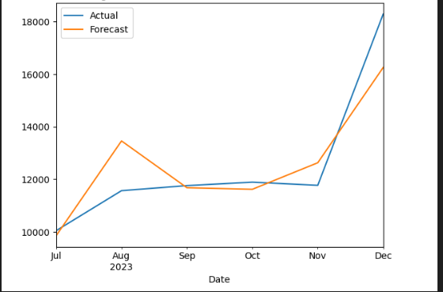****

        
**      \> **SARIMA (2,1,2)(0,1,0,12) with Exogenous Features**    
      **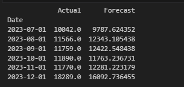**
      **!SARIMA 21201012 exog](figures/SARIMA_21201012_exog_error.png)**
      **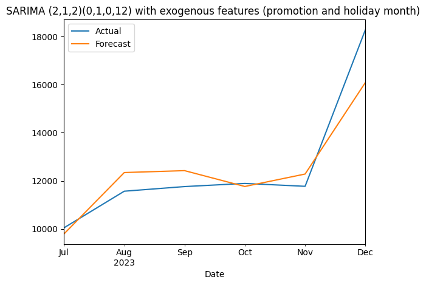****
      
    * *Result:* This is where the magic happened. SARIMAX is built for this. It combines seasonal components ($S$) with the ability to add **external regressors** ($X$). By feeding it the **Promotion** and **HolidayMonth** flags, the model could finally see the *why* behind the numbers.
    * The final tuned model, **SARIMAX(2, 1, 2)(0, 1, 0, 12) + Exogenous**, blew the others away.

* **Attempt 3: Facebook Prophet**
    * *Result:* Much better. Prophet is great with holidays, so I gave it a shot. By tuning its `changepoint_prior_scale` and even setting manual changepoints for Oct-Dec, I got a decent model with an **RMSE of 2,027.45**. It's easy to read, but the accuracy still wasn't where I needed it to be.

---

## 🏆 Model Performance: The Final Tally

The results speak for themselves. The SARIMAX model wasn't just a little better—it cut the error in half compared to the next best option.

| Model | Best Parameters | Best Metric (RMSE) | My Takeaway |
| :--- | :--- | :--- | :--- |
| ARIMA | (Multiple) | ~2,700 - 3,600 | Inadequate. Fails to model seasonality. |
| Prophet | Manual Changepoints, prior_scale=0.5 | 2,027.45 | Good and interpretable, but not the most accurate. |
| **SARIMAX** | **(2, 1, 2)(0, 1, 0, 12) + Exogenous** | **1,017.34** | **WINNER.** Best accuracy & it explains why. |

---

## 🚀 The Payoff: What This Model Delivers

After finding the winner, I retrained the SARIMAX model on the entire 48-month dataset to make it as smart as possible. This final model provides two huge advantages for a business:

* **You Can Finally Measure Marketing:** The model learned the real impact of our promos. The final summary showed that a single promotion adds **+2,457 units to sales** in a given month. The marketing team can now calculate the **precise ROI** for their campaigns.
* **No More Guesswork for Inventory:** I used the model to generate a **6-month rolling forecast**. It gives the operations team a **95% confidence interval**, which is huge. Instead of one number, they get a practical range for planning. This means they can confidently order stock, knowing they've minimized the risk of stockouts and overstocking.

This project provides a clear path from reactive, gut-feel decisions to **proactive, data-driven planning.**

---

## 🛠️ Tech & Libraries Used

* **Python 3.x**
* **pandas:** For all the data wrangling and time series magic.
* **numpy:** For numerical operations and building the dataset.
* **statsmodels:** The powerhouse for time series analysis (ADF, STL, ACF/PACF) and the **SARIMAX model**.
* **prophet:** For building the Prophet comparison model.
* **matplotlib:** For all the visualizations.
* **missingno:** For a quick visual check on missing data.

---

## 📂 Check out the work:

* The main analysis and model building is in the **Retail_Forecasting_Analysis.ipynb** notebook.
* The raw data I generated is **retail_sales_mock_data.csv**.
* The data with engineered lag features is **retail_sales_with_lags.csv**.
